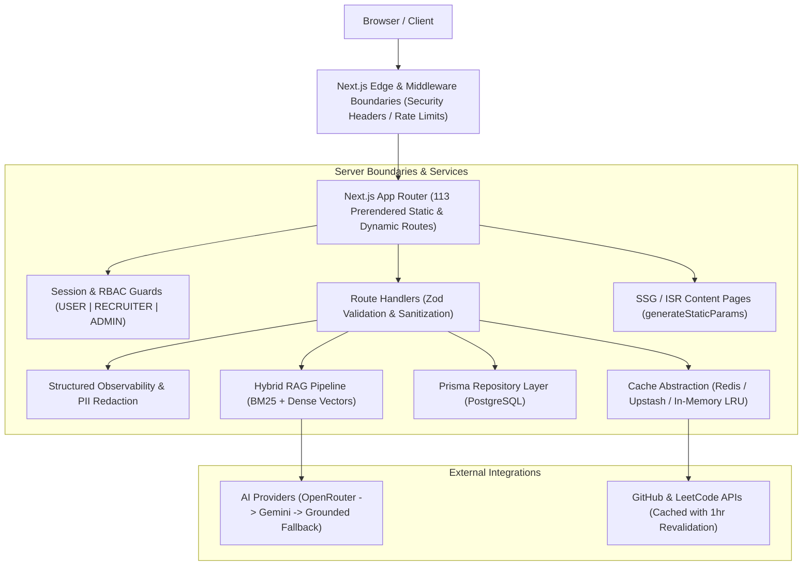
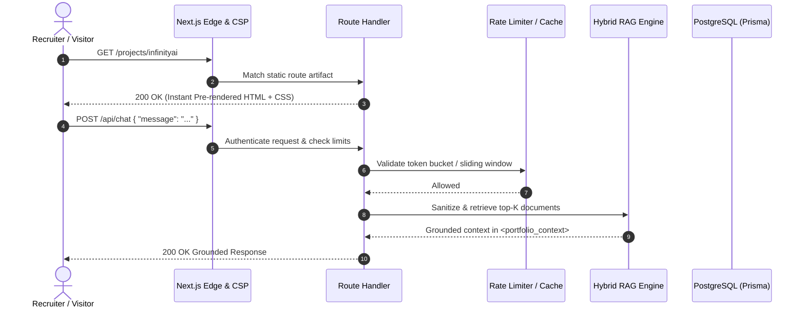

# WishMaster01 Portfolio — System Architecture & Engineering Blueprint

This document details the architectural design, security boundaries, retrieval pipelines, testing layers, and deployment lifecycle of the **WishMaster01 Developer Portfolio & Product Engineering System**.

---

## 1. High-Level Architectural Overview

The portfolio is structured as a production multi-page application leveraging Next.js 16 App Router, TypeScript in strict mode, PostgreSQL via Prisma ORM, and hybrid AI retrieval.

---

## 2. Core Architectural Subsystems

### 2.1 Routing & Static Generation Architecture
- **App Router Model**: 113 routes generated with hybrid static site generation (`SSG`), incremental static regeneration (`ISR`), and on-demand server routes (`Route Handlers`).
- **Dynamic Pre-rendering**: Project detail pages (`/projects/[slug]`, `/projects/[slug]/architecture`, `/projects/[slug]/case-study`), blogs (`/blog/[slug]`), and DSA showcase topics (`/dsa-showcase/[topic]`) are statically generated via `generateStaticParams` for sub-millisecond TTFB.

### 2.2 Security & Authentication (RBAC)
- **Password Security**: Passwords hashed using Node's cryptographic `scrypt` algorithm with a 16-byte random salt and 64-byte derived key. Timing-safe comparison prevents side-channel timing attacks.
- **Session Management**: Cryptographically random 64-character session tokens stored in PostgreSQL with indexed `expiresAt` timestamps. Delivered via HTTP-only, SameSite=Lax, Secure cookies (`auth_session`).
- **Authorization Guard**: Role-based access control (`UserRole`: `USER`, `RECRUITER`, `ADMIN`). Unauthenticated or non-admin requests to `/api/admin/*` or `/admin/*` are rejected with HTTP 401/403.
- **Security Headers**: Strict Content Security Policy (CSP), HTTP Strict Transport Security (HSTS), X-Content-Type-Options (`nosniff`), X-Frame-Options (`DENY`), and Referrer-Policy (`strict-origin-when-cross-origin`).

### 2.3 Hybrid AI Retrieval & Search Intelligence (RAG)
- **BM25 Lexical Engine**: Robertson/Lucene IDF term weighting, $k_1 = 1.2$, $b = 0.75$ document length normalization, and stopword filtering.
- **Dense Vector Search**: Deterministic 256-dimensional subword trigram feature hashing with L2 normalization and cosine similarity scoring.
- **Hybrid Fusion**: Combines lexical relevance ($0.45$), vector similarity ($0.40$), and metadata affinity boosting ($0.15$).
- **Perimeter Defense**: Intercepts instruction overrides, DAN jailbreaks, system prompt exfiltration, and delimiter tampering before reaching LLM providers.
- **Multi-Tier Fallback**: Tier 1 OpenRouter (`gemini-2.0-flash`) -> Tier 2 Gemini Direct -> Tier 3 Grounded Deterministic Engine (derived strictly from top retrieved knowledge documents).

### 2.4 Distributed Caching & Rate Limiting
- **Unified Cache Client**: Transparent interface (`get`, `set`, `del`, `has`, `incr`) connecting to Upstash Redis via REST API if configured, with automatic fallback to high-efficiency in-memory LRU/TTL caching.
- **Rate Limiting**: Multi-algorithm rate limiting (Token Bucket for contacts, Sliding Window for login and AI chat) with automatic client IP detection and Retry-After headers.

### 2.5 Observability & Structured Diagnostics
- **Structured JSON Logging**: Centralized logger generating structured JSON records tracking `requestId`, `route`, `method`, `status`, `latencyMs`, and errors.
- **Automated PII Redaction**: Recursively strips and masks passwords, tokens, API keys, authorization headers, and cookie values.
- **Health Probes**:
  - `/api/health/live`: Liveness probe verifying process runtime and uptime.
  - `/api/health/ready`: Readiness probe verifying PostgreSQL connectivity and process memory health.

### 2.6 Remote Code Sandbox & Judge0 Execution Controls
- **Resource Constraints**: Maximum 64 KB source payload, 10 KB stdin buffer, 6.0s wall time, 4.0s CPU compute limit.
- **Priority Queue Scheduling**: Submissions throttled via bounded `PriorityQueue` (capacity 25). Excess bursts receive HTTP 503 rather than exhausting upstream resources.
- **Deterministic Offline Fallback**: Automated test runner mock handles executions during local testing and when external sandbox credentials are omitted.

---

## 3. Data Flow & Request Lifecycle

---

## 4. Verification & Testing Matrix

The portfolio enforces a multi-tier testing pipeline:
1. **Unit Testing**: 75+ unit tests testing all core algorithms (LRU, LFU, Priority Queue, Trie, Levenshtein, Jaccard, Cosine Similarity, Binary Search, Rolling Window), validation schemas, and security defenses.
2. **Integration Testing**: End-to-end route handler tests validating API contracts, status codes, error paths, and RBAC guards.
3. **AI Benchmarking**: 16-test evaluation suite (`npm run eval:ai`) verifying 100% recall@3, zero prompt-injection bypasses, and anti-hallucination guards.
4. **End-to-End Testing**: Playwright test suite (`tests/e2e/portfolio.spec.ts`) validating 11 critical user flows across Chromium, Firefox, WebKit, and Mobile Chrome.
