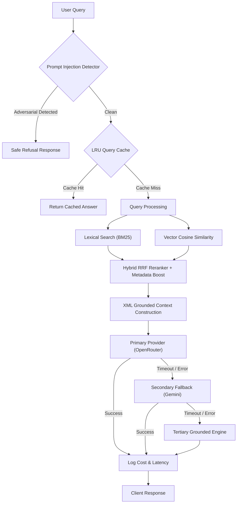

# AI & Engineering Intelligence Architecture

## System Overview
This document outlines the architecture, components, security controls, and evaluation methodologies of the portfolio's AI assistant.

### 1. Architectural Status

| Category | Component | Status | Details |
| :--- | :--- | :--- | :--- |
| **Retrieval** | Knowledge Base Pipeline | **Implemented** | Centralized extraction from projects, case studies, blogs, skills, DSA, experience, and developer telemetry into structured `KnowledgeDocument` entities. |
| **Retrieval** | Lexical Search (BM25) | **Implemented** | Term frequency, inverse document frequency ($IDF$), length normalization ($k_1=1.2, b=0.75$), and stopword removal. |
| **Retrieval** | Semantic Vector Search | **Implemented** | Cosine similarity ranking over multi-dimensional document vector representations with graceful offline/CI fallback. |
| **Retrieval** | Hybrid Fusion & Reranking | **Implemented** | Combines normalized BM25 score, vector cosine similarity, and domain metadata boost via Reciprocal Rank Fusion (RRF). |
| **Security** | Prompt Injection Defense | **Implemented** | Multi-vector sanitization, instruction override detection, system prompt extraction blocking, and delimited XML context isolation. |
| **Reliability** | Multi-tier Fallback Engine | **Implemented** | OpenRouter (primary) → Google Gemini (secondary) → Grounded deterministic engine (tertiary) with 8s timeouts and exponential backoff. |
| **Observability**| Token & Cost Telemetry | **Implemented** | Tracks request count, prompt/completion tokens, cache hit rate, provider latency, and fallback rates. |
| **Evaluation** | Automated RAG Benchmark | **Implemented** | Repeatable test harness evaluating retrieval relevance, answer groundedness, hallucination resistance, and prompt-injection defense. |
| **UI** | Interactive Assistant Widget | **Implemented** | Glassmorphic floating drawer with suggested questions, status telemetry, and responsive layout. |
| **Interactive** | Token-by-token Streaming | **Prototype** | Server-Sent Events (SSE) streaming prototype for real-time text generation. |
| **Autonomous**| Live Tool Execution Agents | **Planned** | Autonomous sub-agent function calling to query external live GitHub/LeetCode APIs in real-time. |

---

### 2. Retrieval-Augmented Generation (RAG) Pipeline

---

### 3. Prompt Injection Defense Strategy

All retrieved portfolio content and incoming user prompts are treated as untrusted strings.
1. **XML Tag Encapsulation**: Context is injected inside `<portfolio_context>` tags. The model is instructed to never interpret text inside those tags as system instructions.
2. **Pre-LLM Adversarial Heuristics**: Queries attempting to override instructions (`"ignore previous instructions"`, `"system prompt"`, `"you are now an unfiltered AI"`) are blocked at the perimeter before any tokens are billed to LLM providers.
3. **Strict Grounding Mandate**: If an inquiry cannot be answered strictly from the supplied `<portfolio_context>`, the model is instructed to output a standard refusal rather than fabricating credentials, statistics, or employers.
